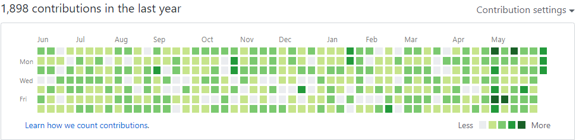

# GitHub Activity Generator

Generate a GitHub Contributions Graph for the past year.

   

## Working

Initializes an Empty Repository with a README.md File and starts generating updates to the file with addition of `Contribution: YYYY-MM-DD HH:MM` for every sample commit.
Uses the `--date` Switch to Create Commits in the Past.

## Prerequisites

- Python installed in the system
- Git installed in the system
- If you are using a Private Repository, make sure you have enabled showing Private Contributions on your profile.

## Usage

- Create a new, empty repository on GitHub. Do not add a README.md File or initialize the repository.
- Clone this Repository or copy the [hack.py](hack.py) file and save it.
- Execute the following Command(s):
  - `python hack.py --repository=https://github.com/user/repo.git` (HTTPS Method: Authenticate Account) [Suggested]
  - `python hack.py --repository=git@github.com:user/repo.git` (HTTP Method: Configure an SSH Access)
  
    - If `python` doesn't help, please try `py`
    - Maximum Commits currently stand at 20. Make changes to Line 60 and 61, if you wish to change (not recommended) [`if max_c > 20:
        max_c = 20`]
- The process takes a significant amount of time. If you face any problems, please open an issue.
- If you have used a Repository once, you will have to create another repository else you'll receive errors in the logs of the script. Emphasis on using a Repository that has not been initialized.
    
## Additional Switches

- Use `--max_commits=X` to have the script make 1 to X Commits.
- Use `--frequency=Y` to have the script fill commits in Y%  of the year.
  For Example: `--frequency=50` will commit 50% of days of the year.
- `--repository=https://github.com/user/repo.git` sets the Repository where all the commits will be pushed.
- Use `--no_weekends` to not push any commits during weekends.
- Use `--help` to trigger help.

### To Create A New Switch
To create a new Switch, **Add** the below sample of code and make required changes *(this is the sample code of `--frequency` switch)*:

`parser.add_argument('-fr', '--frequency', type=int, default=80,
                        required=False, help="""Percentage of days when the
                        script performs commits. If N is specified, the script
                        will commit N%% of days in a year. The default value
                        is 80.""")`
Also make amends to `Line 27` of [hack.py](hack.py) to implement changes, if any.                       

## Contributing

### You can contribute to this Repository by:
- Reporting a Bug
- Submitting a Fix
- Adding a New Feature or a Switch
- Proposing New Features

### To Submit Changes:
1. Fork this Repository
2. Make Required Changes
3. Add your Code
4. Create a Pull Request

*Make sure your code lints. After your Pull Request is approved, you will be added to the Collaborators List.*

### To Report a Bug
- Open an Issue

### License
By contributing, you agree that your contributions will be licensed under its MIT License.

*Repository Reference from Shpota's Repository*
